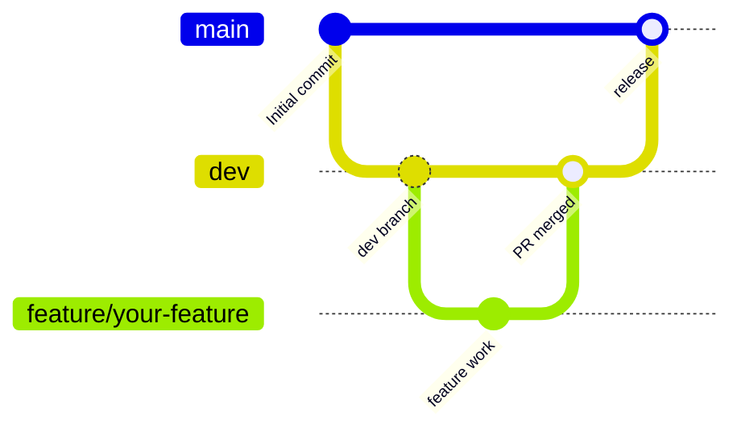
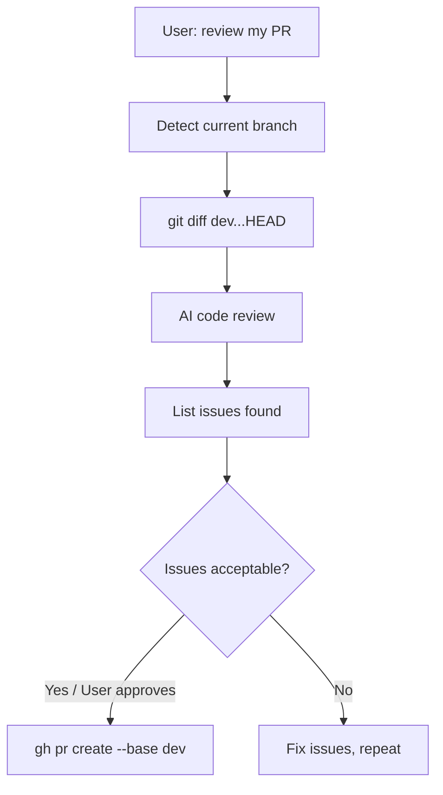

# Qaswa Jewellers Git Flow Setup

## What will be set up

- Private GitHub repo `qaswa_jewellers` with `main` and `dev` branches
- A Flutter `.gitignore` to exclude build artifacts
- A Cursor Rule (`.cursor/rules/git-flow.mdc`) that permanently encodes the PR workflow — so whenever you say "review my PR" or "create a PR", I automatically know the exact steps to take
- A reusable shell script (`.cursor/scripts/pr-review.sh`) that diffs the current branch against `dev` and formats output for review

## Git Flow Diagram

## Automated PR Workflow (triggered by "review my PR")

## Files to create

- `.gitignore` — standard Flutter gitignore (excludes `build/`, `.dart_tool/`, etc.)
- `.cursor/rules/git-flow.mdc` — always-apply rule encoding the review+PR workflow
- `.cursor/scripts/pr-review.sh` — script that runs `git diff dev...HEAD` and surfaces stats/files changed for review context

## Step-by-step execution

1. Add `.gitignore` (Flutter template)
2. `git init && git add . && git commit -m "Initial commit"`
3. `gh repo create qaswa_jewellers --private --source=. --remote=origin --push` — creates the GitHub repo and pushes `main`
4. `git checkout -b dev && git push -u origin dev` — create and push `dev` branch
5. Create `.cursor/rules/git-flow.mdc` with the PR review workflow instructions
6. Create `.cursor/scripts/pr-review.sh` and make it executable

## The Cursor Rule (what gets automated)

The rule will instruct me to — whenever you say "review my PR":
1. Run `git branch --show-current` to confirm the feature branch
2. Run `.cursor/scripts/pr-review.sh` to get the full diff vs `dev`
3. Perform a structured review (architecture, logic, style, tests)
4. Output a numbered issue list
5. Wait for your go-ahead, then run `gh pr create --base dev --title "..." --body "..."`

## Prerequisites needed on your machine

- `gh` CLI installed and authenticated (`gh auth login`) — needed for repo creation and PR creation
- `git` installed (you have it)
